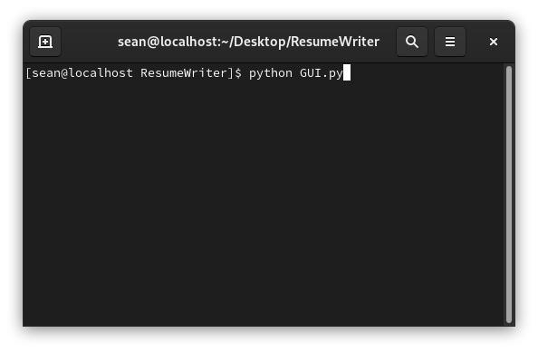
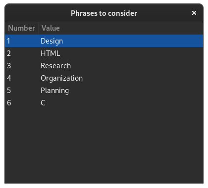

# Objective of ResumeME

To craft the path for each individual to find and be prepared for embarking on their journey to success with the perfect job.

# Inspiration

The typical job seeker spends **3 - 4 hours** preparing and submitting 1 application while 72% of employers spend **less than 15 minutes** reviewing an application. Additionally, there are articles indicating that one should reduce the number of applications they send out, but rather spend that time customising their application for every position.

# What it does

ResumeME allows **quick customisation** of one's resume to fit the job position. This ensures that the user will have a **customised version of his/her resume** for every job, increasing the chances for an interview and smoothening the job application process.

# How to run the program?

1. Execute the Graphical User Interface file.
run "python GUI.py" in the terminal.

2. Source the job webpage.

3. Copy the link from the webpage.

4. Paste the link in the Graphical user interface.

5. The interface will reflect the skills required for the job. 

# Looking forward...

1. Implement the program as a web application to enable convenient access on any platform.

2. Utilising artificial intelligence to identify and update skills database with new skills required in the future.

3. Find, assist users to craft resume and submit them to the company.

4. Summarised fact sheet of the company to prepare users for their interview.

# FAQ
**Q:** Want to add a skill?
**A:** Add the skill in a new line to "skills.txt"

**Q:** What do I need to run the program?
**A:** 
Python 3  
Scrapy  
Selenium

**Q:** Is this project featured elsewhere?
**A:**
Yes, this project is also featured on [Devpost](https://devpost.com/software/resumeme) for Hack&Roll 2021
